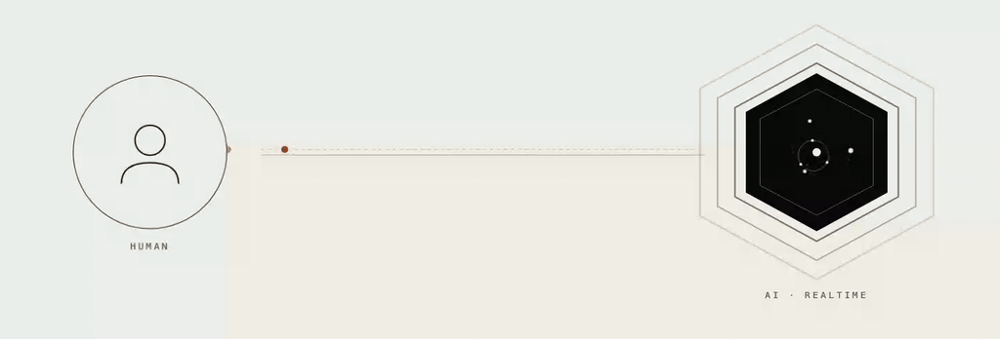

# ODSC 2026 — Building Voice Agents

A hands-on tutorial repository for the ODSC 2026 session on real-time voice agents. The three examples walk from a classic chained speech pipeline to a single multimodal realtime model, finishing with the same model packaged as a runnable local agent.

**Slides:** [soltaniehha.com/odsc](https://soltaniehha.com/odsc)

## Contents

### `01-STT-LLM-TTS-Agent.ipynb`


A chained voice agent on LiveKit Cloud (free tier) that you talk to from an in-notebook widget. Audio flows over WebRTC between the browser and a LiveKit room while the Python kernel joins the same room as the agent worker. The pipeline stitches together Deepgram Nova 3 for speech-to-text, GPT-4.1 mini for reasoning, Cartesia Sonic 3 for text-to-speech, and Silero VAD with a multilingual turn detector for natural turn-taking. Open the notebook in Google Colab and run the cells in order.

### `02-Realtime-Voice.ipynb`



A two-way live voice chat with OpenAI's `gpt-realtime` model — a single multimodal model that handles speech-in and speech-out without a separate STT or TTS step. The browser captures the microphone and plays the response over WebRTC, while Python keeps the API key and brokers the SDP handshake with OpenAI. The contrast with the first notebook highlights what realtime models change about agent architecture. Open in Google Colab and run the cells in order.

### `03-Realtime-Voice-Local.py`

The same realtime model as notebook 2, repackaged as a LiveKit Agent that runs on your own machine. The LiveKit Agents framework handles microphone capture, voice activity detection, and audio playback, so the file stays under forty lines while remaining production-shaped.

**Run it locally:**

```bash
# 1. Create a virtual environment and install dependencies
python -m venv .venv
source .venv/bin/activate
pip install "livekit-agents[openai]" python-dotenv

# 2. Create a .env file in this folder with the following keys
cat > .env <<'EOF'
OPENAI_API_KEY=sk-...
LIVEKIT_URL=wss://your-project.livekit.cloud
LIVEKIT_API_KEY=APIxxxxxxxx
LIVEKIT_API_SECRET=secretxxxxxxxxxxxx
EOF

# 3. Talk to the agent in your terminal
python 03-Realtime-Voice-Local.py console
```

Press `Ctrl-C` to stop. The LiveKit credentials are required even for `console` mode because the agent registers as a worker with LiveKit Cloud regardless of how you connect. Sign up free at [cloud.livekit.io](https://cloud.livekit.io) to get them. To connect from a browser instead, swap `console` for `dev` and open [agents-playground.livekit.io](https://agents-playground.livekit.io).
